# Detailed Record Enhancement Implementation Plan

> **For Codex:** REQUIRED SUB-SKILL: Use `executing-plans` when implementing this plan task-by-task. If the user starts a future goal-mode run, create a goal for the full objective and execute this document until the Definition of Done is satisfied.

**Goal:** Upgrade BiliSum's `逐句实录` into a faithful, readable, discourse-aligned transcript mode that preserves full subtitle coverage, supports optional local LLM polishing at micro-segment level, and exposes Markdown + JSON artifacts cleanly to hotspot-collector and the frontend.

**Architecture:** Keep BiliSum as the owner of note-mode generation and artifact schemas. Keep hotspot-collector as the upstream orchestrator that selects note modes and packages generated artifacts. The main design is a deterministic transcript formatter with an optional bounded LLM polishing stage; LLM must never be the only source of coverage, ordering, or timeline structure.

**Tech Stack:** Python 3.13 BiliSum core, existing OpenAI-compatible LLM client in `video_sum_core.pipeline.real`, BiliSum desktop/web frontend, hotspot-collector TypeScript CLI/package pipeline, pytest, npm typecheck/build.

---

## 1. Background

The current `逐句实录` implementation was changed away from whole-note LLM generation because long videos could lose large middle sections. The real test with `BV1GcGX6iEUG` confirmed the new local formatter preserves coverage:

- Source subtitle segments: 214
- Covered segments: 214
- Coverage ratio: 1.0
- Missing segments: none
- Duplicate segments: none
- Markdown no longer embeds `### 时间轴`

The remaining problem is output quality. Some filler words and oral fragments remain, for example `呃`, `啊`, `嗯`, and short duplicated connectors. Diagnosis showed that this is not an LLM quality issue: `逐句实录` export currently calls `build_detailed_record_from_segments(...)` directly, while the old `_generate_detailed_record_with_llm(...)` function is not used by the actual export path.

The old LLM function should not be reconnected as-is. It uses transcript excerpts, and long transcripts are truncated to head + tail. That would reintroduce the original long-video loss risk.

## 2. Product Requirements

`逐句实录` is an enhanced transcript, not a summary.

It must:

- Preserve the original material's order, person, tone, and details.
- Remove only obvious oral noise, repeated short words, and fixable recognition artifacts.
- Avoid turning text into third-person summary such as `作者认为` or `本段介绍`.
- Split content into suitable discourse micro-segments.
- Generate JSON + Markdown dual artifacts.
- Generate timeline data for the frontend side panel, not as a Markdown heading.
- Support one selected note mode by default, while still allowing multiple note modes when explicitly requested.
- Keep knowledge note behavior unchanged.

## 3. Non-Goals

Do not implement these in the first long-term refactor:

- External JSON plugin directories for note modes.
- A generic prompt marketplace.
- Whole-video LLM rewrite for `逐句实录`.
- ASR fallback changes.
- A new database schema.
- Frontend redesign beyond the timeline/polished transcript display required by this mode.

## 4. Current Code Facts

BiliSum fork path:

`E:\Project\hotspot-collector-external\BiliSum`

Important files:

- `packages/core/src/video_sum_core/note_modes.py`
  - Owns note-mode registry and detailed-record JSON/Markdown construction.
  - Current formatter name: `formatted_transcript_pipeline`.
  - Current filler regex only removes standalone or sentence-initial filler words.
- `packages/core/src/video_sum_core/pipeline/real.py`
  - Knowledge note LLM generation is called around the summary pipeline.
  - Detailed record export currently calls `build_detailed_record_from_segments(...)`.
  - `_generate_detailed_record_with_llm(...)` exists but is not used in real detailed-record export.
- `tests/unit/test_task_models.py`
  - Already contains note-mode and detailed-record tests.
- `apps/desktop/src/pages/VideoDetailPage.tsx`
  - Reads selected note variant and can display structured timeline.
- `apps/web/static/index.html` and `apps/web/static/assets/*`
  - Must be rebuilt and committed when frontend bundle references change.

hotspot-collector path:

`E:\Project\hotspot-collector`

Important areas:

- Video note CLI and BiliSum orchestration commands under `src/cli` and video-note pipeline modules.
- Learning package output under `E:\Project\hotspot-collector-data\video-notes`.
- Existing command shape:

```powershell
npm.cmd run video:notes-bilibili -- --url=https://www.bilibili.com/video/BV1GcGX6iEUG --note-modes=knowledge_note,detailed_record --primary-note-mode=detailed_record
```

## 5. Target Architecture

```mermaid
flowchart LR
  A["Bilibili subtitle segments"] --> B["Normalize source segments"]
  B --> C["Local conservative cleanup"]
  C --> D["Sentence unit construction"]
  D --> E["Rule-based discourse micro-segmentation"]
  E --> F["Section and timeline builder"]
  F --> G{"LLM micro-polish enabled?"}
  G -- "No" --> H["Local detailed record"]
  G -- "Yes" --> I["Per-micro-segment LLM polish"]
  I --> J["Coverage and faithfulness validation"]
  J -- "Pass" --> K["Polished detailed record"]
  J -- "Fail" --> H
  H --> L["Markdown + JSON artifacts"]
  K --> L
  L --> M["hotspot-collector learning package"]
  M --> N["Frontend transcript + collapsed timeline"]
```



### Key Principle

Local deterministic code owns:

- Source segment normalization
- Coverage
- Ordering
- Timeline
- Section/micro-segment boundaries
- JSON schema
- Markdown rendering
- LLM fallback behavior

LLM only owns:

- Optional local polishing of already-built micro-segment text
- Punctuation improvement
- Filler removal
- Obvious ASR typo repair
- Fragment merging inside one micro-segment

## 6. Data Contract

Detailed-record JSON should remain backward compatible with current v2 shape, with additive fields only.

Recommended fields:

```json
{
  "version": 2,
  "mode": "detailed_record",
  "style": "discourse_aligned_transcript",
  "title": "",
  "sections": [
    {
      "id": "sec_1",
      "index": 1,
      "title": "",
      "start": 0,
      "end": 120,
      "sourceSegmentIds": [1, 2],
      "microSegments": [
        {
          "id": "m_1",
          "index": 1,
          "start": 0,
          "end": 35,
          "text": "",
          "sourceSegmentIds": [1, 2],
          "visualRefs": [],
          "polish": {
            "provider": "local",
            "status": "not_requested",
            "edits": []
          }
        }
      ]
    }
  ],
  "timeline": [
    {"start": 0, "end": 120, "title": ""}
  ],
  "coverage": {
    "sourceSegmentCount": 0,
    "coveredSegmentCount": 0,
    "coverageRatio": 1.0,
    "missingSegmentIds": [],
    "duplicateSegmentIds": [],
    "maxGapSeconds": 0
  },
  "formatter": {
    "name": "formatted_transcript_pipeline",
    "version": 2,
    "llmPolishEnabled": false
  }
}
```

## 7. Configuration

First implementation should use built-in settings only. Do not add plugin directories.

Recommended BiliSum settings:

```python
detailed_record_llm_polish_enabled: bool = False
detailed_record_llm_polish_max_chars: int = 900
detailed_record_llm_polish_concurrency: int = 2
detailed_record_llm_polish_retry_count: int = 1
detailed_record_micro_min_chars: int = 180
detailed_record_micro_target_chars: int = 360
detailed_record_micro_max_chars: int = 700
detailed_record_micro_max_duration_seconds: int = 120
```

Default should remain conservative:

- `note_modes = ["knowledge_note"]`
- `primary_note_mode = "knowledge_note"`
- `detailed_record_llm_polish_enabled = false`

hotspot-collector can later pass these values explicitly for test or advanced runs.

## 8. LLM Micro-Polish Design

### Input Shape

Each LLM request receives only one micro-segment:

```json
{
  "microSegmentId": "m_12",
  "title": "video title",
  "sectionTitle": "section title",
  "start": 320.5,
  "end": 374.2,
  "sourceSegments": [
    {"id": 101, "start": 320.5, "end": 324.1, "text": "..."}
  ],
  "localText": "..."
}
```

### Output Shape

```json
{
  "text": "...",
  "sourceSegmentIds": [101, 102, 103],
  "edits": ["remove_filler", "punctuation", "merge_fragments"]
}
```

### Prompt Rules

The prompt must say:

- This is transcript polishing, not summarization.
- Preserve person and order.
- Do not add examples, conclusions, concepts, or external information.
- Do not write headings, bullets, Markdown, or timeline.
- Remove obvious filler words only when they do not carry meaning.
- Keep the same `sourceSegmentIds`.
- Return JSON only.

### Validation Rules

Accept LLM result only if:

- `sourceSegmentIds` exactly equals the input micro-segment IDs.
- `text` is non-empty.
- `text` length is at least 65% of local text length, unless local text is very short.
- `text` does not contain forbidden summary markers:
  - `作者认为`
  - `本段介绍`
  - `这一部分`
  - `视频中提到`
  - `UP主认为`
- `text` does not contain Markdown headings or bullet-list structure.
- The result does not introduce obvious timeline text.

On validation failure, keep local text and record:

```json
"polish": {
  "provider": "llm",
  "status": "rejected",
  "reason": "coverage_mismatch"
}
```

## 9. Local Cleanup Design

Local cleanup should be stronger than the current regex, but still conservative.

Add tests before changing behavior.

Target cleanup cases:

- Sentence-initial fillers:
  - `呃，这个功能...` -> `这个功能...`
  - `嗯 然后...` -> `然后...`
- Mid-sentence fillers with punctuation or common oral markers:
  - `这个检索是呃输入关键词` -> `这个检索是输入关键词`
  - `那在这里啊我做成了...` -> `那在这里我做成了...`
- Repeated connectors:
  - `然后然后` -> `然后`
  - `就是就是` -> `就是`
  - `这个这个` -> `这个`
- Lightweight spacing and punctuation normalization.

Do not remove:

- Meaningful `啊` used as sentence tone at final position if removal would make the sentence unnatural.
- Characters inside proper nouns or technical terms.
- Any full clause only because it is awkward.

## 10. Micro-Segmentation Design

Current micro-segments can be too short. The next version should target paragraph-like transcript units.

Recommended defaults:

- Min chars: 180
- Target chars: 360
- Max chars: 700
- Soft gap: 1.2s
- Hard gap: 2.5s
- Max duration: 120s

Boundary scoring should prefer splits at:

- Strong punctuation: `。！？`
- Discourse markers: `首先`, `然后`, `接下来`, `这里`, `所以`, `总结`, `回到`
- Real time gaps
- Summary chapter boundaries when available
- Topic-like transitions in BiliSum summary chapters

Boundary scoring should avoid splits:

- Inside very short fragments
- Before the current micro-segment reaches min chars
- When source subtitles are merely one sentence split into many short Bilibili subtitle rows

## 11. Frontend Contract

The frontend should not infer timeline from Markdown.

It should:

- Read `selectedNoteVariant.structured.timeline`.
- Show timeline as a right-side panel.
- Keep the panel collapsed by default.
- Only show the timeline control when the selected note variant is `detailed_record` and timeline data exists.
- Never show detailed-record visual-note controls on the knowledge-note tab.

Markdown should render only the transcript body.

## 12. hotspot-collector Contract

hotspot-collector should remain thin:

- It selects `note_modes`.
- It selects `primary_note_mode`.
- It may pass optional detailed-record polish settings later.
- It packages returned `NoteVariant` artifacts into the learning package.
- It should not parse or rewrite detailed-record Markdown.

The learning package must preserve:

- `primaryNoteMode`
- `noteVariants[].id`
- `noteVariants[].contentType`
- `noteVariants[].artifactPath`
- `noteVariants[].structuredArtifactPath`
- `noteVariants[].quality.coverage`

## 13. Goal-Mode Execution Objective

When the user later says to execute this through goal mode, create a goal with this objective:

```text
Complete the detailed-record long-term refactor across the BiliSum fork and hotspot-collector: strengthen local transcript cleanup, improve discourse micro-segmentation, add optional validated per-micro-segment LLM polishing, preserve JSON + Markdown artifacts and frontend timeline behavior, update hotspot-collector orchestration only where needed, run unit/type/build tests, and validate with BV1GcGX6iEUG plus one long-video case.
```

Do not mark the goal complete until all Definition of Done items pass.

## 14. Implementation Tasks

### Task 1: Add Regression Tests for Local Cleanup

**Repo:** `E:\Project\hotspot-collector-external\BiliSum`

**Files:**

- Modify: `tests/unit/test_task_models.py`
- Modify: `packages/core/src/video_sum_core/note_modes.py`

**Steps:**

1. Add tests for sentence-initial filler cleanup.
2. Add tests for mid-sentence filler cleanup.
3. Add tests for repeated connector cleanup.
4. Add a negative test for not deleting meaningful Chinese text.
5. Run:

```powershell
$tmp='E:\Project\hotspot-collector-data\tmp\pytest-bilisum'
New-Item -ItemType Directory -Force -Path $tmp | Out-Null
$env:TMP=$tmp
$env:TEMP=$tmp
$env:PYTEST_DISABLE_PLUGIN_AUTOLOAD='1'
uv run --all-packages pytest -o cache_dir=$tmp\.pytest_cache tests\unit\test_task_models.py -q
```

Expected first result before implementation: failing cleanup assertions.

### Task 2: Implement Conservative Local Cleanup

**Repo:** `E:\Project\hotspot-collector-external\BiliSum`

**Files:**

- Modify: `packages/core/src/video_sum_core/note_modes.py`
- Test: `tests/unit/test_task_models.py`

**Steps:**

1. Update filler regex and helper functions.
2. Keep cleanup inside `_clean_transcript_text(...)`.
3. Do not add LLM calls in this task.
4. Run the same pytest command.
5. Confirm all existing detailed-record coverage tests still pass.

### Task 3: Make Micro-Segmentation Tunable

**Repo:** `E:\Project\hotspot-collector-external\BiliSum`

**Files:**

- Modify: `packages/core/src/video_sum_core/note_modes.py`
- Modify: `packages/core/src/video_sum_core/pipeline/real.py`
- Test: `tests/unit/test_task_models.py`

**Steps:**

1. Introduce a small config object or keyword args for detailed-record formatter settings.
2. Preserve existing defaults unless settings are provided.
3. Add tests that long subtitle input does not produce tiny micro-segments under new recommended settings.
4. Add tests that coverage remains 1.0.
5. Run unit tests.

### Task 4: Add Settings Fields

**Repo:** `E:\Project\hotspot-collector-external\BiliSum`

**Files:**

- Modify: `packages/core/src/video_sum_core/pipeline/real.py`
- Modify settings model files if settings are split elsewhere.
- Test: relevant settings/task model tests.

**Steps:**

1. Add built-in detailed-record formatter settings.
2. Add built-in LLM polish settings with default disabled.
3. Ensure service settings API exposes safe booleans and numeric values but never API keys.
4. Run unit tests.

### Task 5: Add LLM Micro-Polish Payload Builder

**Repo:** `E:\Project\hotspot-collector-external\BiliSum`

**Files:**

- Modify: `packages/core/src/video_sum_core/pipeline/real.py`
- Test: `tests/unit/test_task_models.py`

**Steps:**

1. Add `_build_llm_detailed_record_micro_polish_payload(...)`.
2. The payload must include only one micro-segment and its source subtitles.
3. Add a unit test that the prompt forbids summarization and requires JSON only.
4. Add a unit test that the input does not use `_build_transcript_excerpt(...)`.
5. Run unit tests.

### Task 6: Add LLM Micro-Polish Validation

**Repo:** `E:\Project\hotspot-collector-external\BiliSum`

**Files:**

- Modify: `packages/core/src/video_sum_core/note_modes.py` or a focused helper module if the function grows.
- Test: `tests/unit/test_task_models.py`

**Steps:**

1. Add a validator for micro-polish output.
2. Test exact `sourceSegmentIds` match.
3. Test short output rejection.
4. Test summary-marker rejection.
5. Test valid punctuation/filler cleanup acceptance.
6. Run unit tests.

### Task 7: Integrate Optional LLM Micro-Polish

**Repo:** `E:\Project\hotspot-collector-external\BiliSum`

**Files:**

- Modify: `packages/core/src/video_sum_core/pipeline/real.py`
- Modify: `packages/core/src/video_sum_core/note_modes.py`
- Test: `tests/unit/test_task_models.py`

**Steps:**

1. Keep local formatter as the first stage.
2. If `detailed_record_llm_polish_enabled` is false, return local output unchanged.
3. If enabled and LLM config exists, polish micro-segments concurrently with bounded concurrency.
4. Validate each LLM result.
5. Fall back per micro-segment, not per whole note.
6. Record polish status in JSON.
7. Run tests.

### Task 8: Preserve Markdown and Timeline Behavior

**Repo:** `E:\Project\hotspot-collector-external\BiliSum`

**Files:**

- Modify: `packages/core/src/video_sum_core/note_modes.py`
- Modify: `apps/desktop/src/pages/VideoDetailPage.tsx`
- Modify: `apps/desktop/src/styles/05-detail-page.css`
- Modify: `apps/desktop/src/styles/08-responsive.css`
- Test: frontend typecheck/build.

**Steps:**

1. Confirm Markdown renderer does not output `### 时间轴`.
2. Confirm frontend timeline reads structured JSON only.
3. Confirm knowledge-note tab does not show detailed-record timeline/visual controls.
4. Run:

```powershell
cmd /c npm run typecheck
cmd /c npm run build:renderer
```

### Task 9: Update hotspot-collector Orchestration if Needed

**Repo:** `E:\Project\hotspot-collector`

**Files:**

- Modify only the video-note BiliSum orchestration files that pass note-mode options.
- Do not modify unrelated skills or generated scripts unless required.

**Steps:**

1. Confirm existing CLI can pass `note_modes` and `primary_note_mode`.
2. Add optional detailed-record polish flags only if BiliSum exposes them through the task API.
3. Keep default behavior as knowledge note.
4. Run relevant TypeScript tests or at least:

```powershell
npm.cmd run typecheck
```

Use the repository's actual available scripts if `typecheck` differs.

### Task 10: Real Case Verification

**Repos:** both

**Steps:**

1. Ensure BiliSum service is healthy:

```powershell
npm.cmd run video:bilisum-status
```

2. Generate the known test case:

```powershell
npm.cmd run video:notes-bilibili -- --url=https://www.bilibili.com/video/BV1GcGX6iEUG --note-modes=knowledge_note,detailed_record --primary-note-mode=detailed_record
```

3. Verify:

- `detailed_record.json` exists.
- `detailed_record.md` exists.
- `coverage.coverageRatio == 1.0`.
- `missingSegmentIds == []`.
- Markdown does not contain `### 时间轴`.
- Learning package `primaryNoteMode == detailed_record`.
- `noteVariants` contains `knowledge_note` and `detailed_record`.

4. Run a second long-video case selected by the user or from existing local test history.
5. Compare:

- Segment coverage
- Micro-segment count
- Average micro-segment length
- Filler residual count
- Whether frontend shows timeline only under `逐句实录`

## 15. Definition of Done

The refactor is complete only when:

- BiliSum tests pass.
- Frontend typecheck passes.
- Renderer build passes when frontend bundle changes.
- `BV1GcGX6iEUG` real generation succeeds.
- At least one long-video test succeeds without middle-section loss.
- `detailed_record.json` records coverage and formatter metadata.
- `detailed_record.md` contains no timeline heading.
- Optional LLM polish never lowers coverage.
- LLM validation rejects summary-like or coverage-mismatched output.
- hotspot-collector learning package preserves Markdown + JSON artifact refs.
- Dirty unrelated user changes are not reverted or mixed into commits.

## 16. Commit Plan

Use small commits in the BiliSum fork:

1. `test: cover detailed record transcript cleanup`
2. `feat: improve detailed record local cleanup`
3. `feat: tune detailed record micro segmentation`
4. `feat: add optional detailed record llm polish`
5. `feat: expose detailed record timeline cleanly`

Use a separate hotspot-collector commit only if orchestration changes are needed:

1. `feat: pass detailed record polish options to bilisum`

Do not include unrelated files:

- Existing unrelated main repo changes such as `skills/hotspot-collector-orchestrator/skill/SKILL.md`
- Existing unrelated untracked scripts unless the task requires them
- Old unreferenced Vite bundles

## 17. Risks and Mitigations

Risk: LLM rewrites or summarizes content.

Mitigation: Only polish one micro-segment at a time and validate source IDs, length, and forbidden phrases.

Risk: LLM increases cost on long videos.

Mitigation: Default disabled, bounded concurrency, one request per micro-segment, max chars per micro-segment.

Risk: Cleanup deletes meaningful words.

Mitigation: Unit tests for negative cases and conservative regexes.

Risk: Frontend shows controls under the wrong note tab.

Mitigation: Gate timeline and visual-note controls by selected note variant ID.

Risk: Upstream BiliSum changes are hard to merge.

Mitigation: Keep changes inside note-mode registry, detailed-record formatter, and existing pipeline settings. Avoid broad frontend redesign and plugin architecture.

## 18. Open Decisions Before Execution

These can be decided at implementation time if the user does not specify:

- Whether `detailed_record_llm_polish_enabled` should be exposed in hotspot-collector CLI immediately or only in BiliSum settings.
- Which long video should be used as the second real verification case.
- Whether first production default should keep LLM polish off or enable it only for explicit `--detailed-record-polish`.

Recommended defaults:

- Expose explicit CLI flag only after BiliSum implementation is stable.
- Keep LLM polish off by default.
- Use `BV1GcGX6iEUG` as the short known case and ask the user for a long case, unless a known local long-video artifact already exists.
